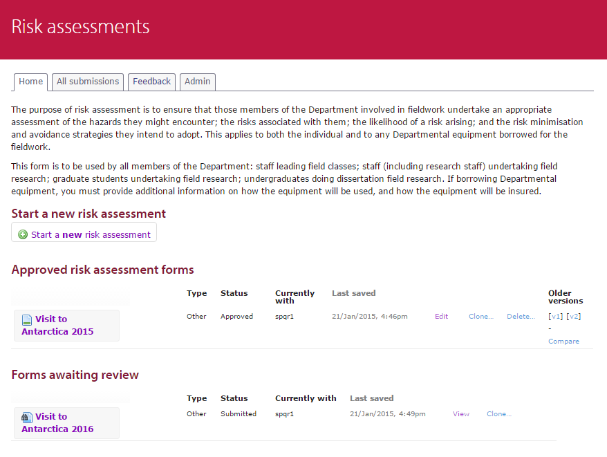

Reviewable assessments system
=============================

This is a PHP application which implements a system for assessments such as risk assessments, whereby the application by a student is then passed for review to other in a position of authority and iterated until approved.

It is intended to treated as a library included within boostrapping code defining the forms and parameters.

Screenshot
----------

Usage
-----

1. Clone the repository.
2. Run `composer install` to install the PHP dependencies.
3. Download and install the famfamfam icon set in /images/icons/
4. Add the Apache directives in httpd.conf (and restart the webserver) as per the example given in .httpd.conf.extract.txt; the example assumes mod_macro but this can be easily removed.
5. Create a copy of the index.html.template file as index.html, and fill in the parameters.
6. Access the page in a browser at a URL which is served by the webserver.

Dependencies
------------

* Composer package manager
* [FamFamFam Silk Icons set](http://www.famfamfam.com/lab/icons/silk/)

Author
------

Martin Lucas-Smith, Department of Geography, 2013-24.

License
-------

GPL3.

